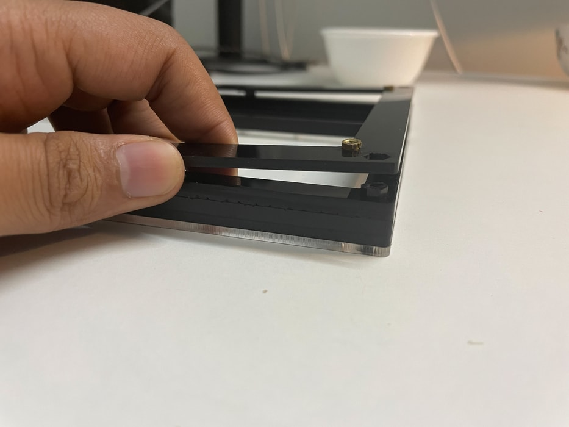
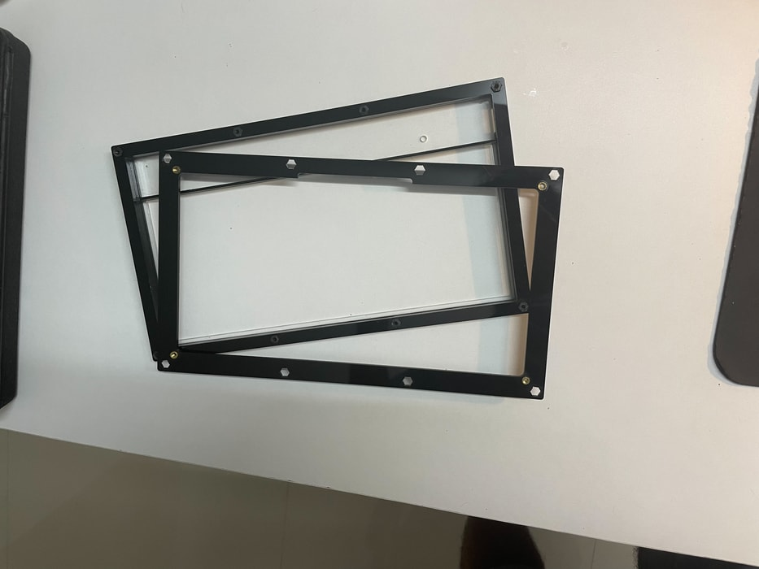
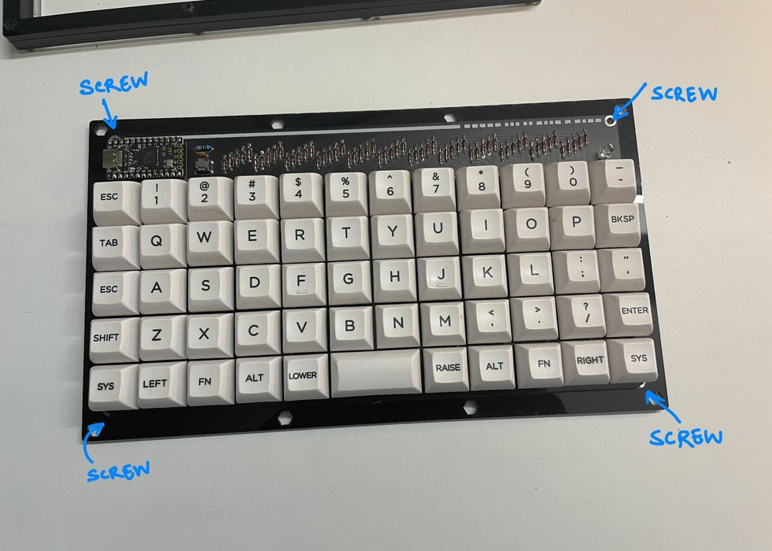
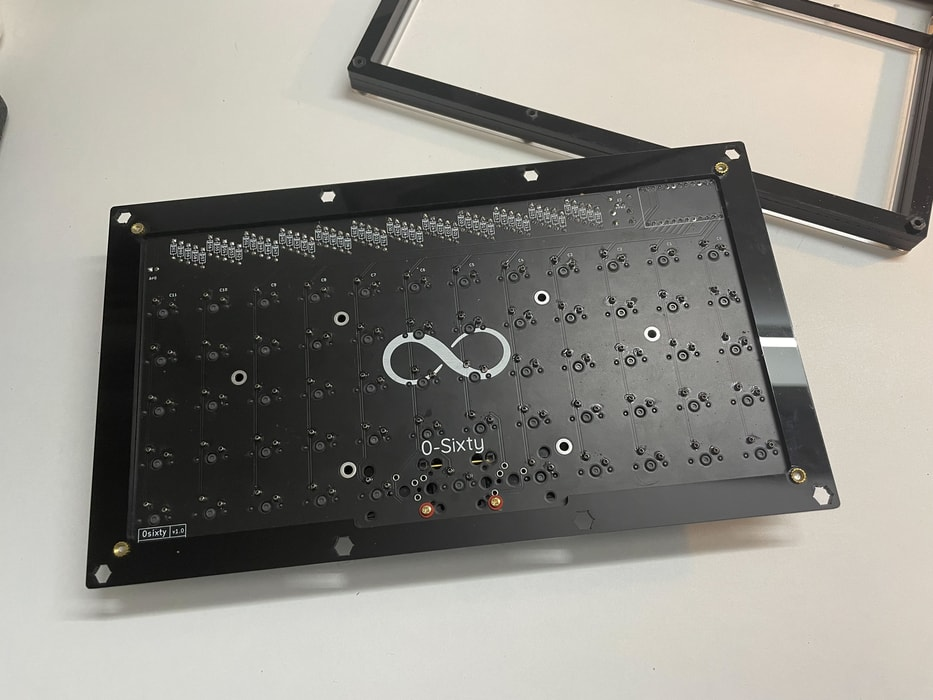
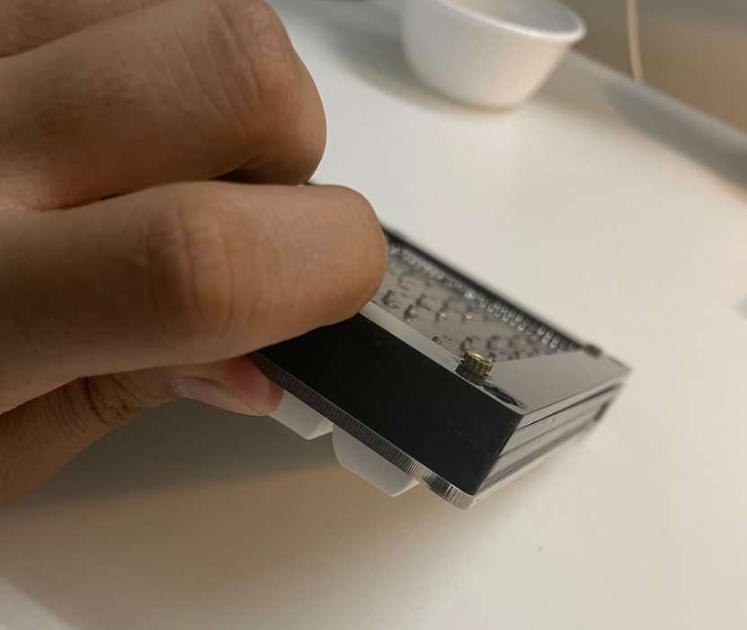
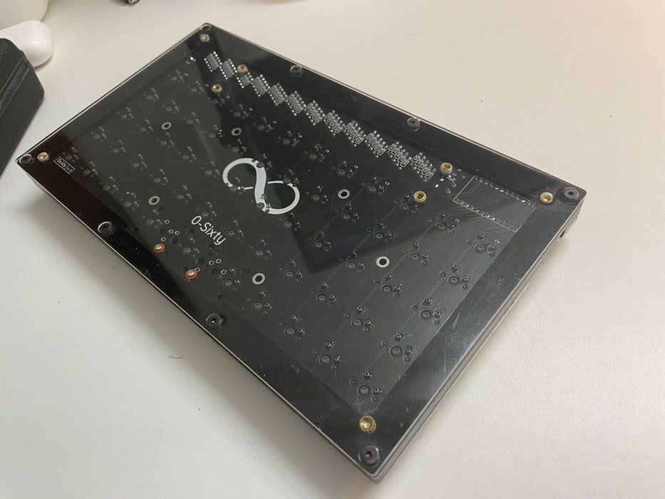

# 0-Sixty R2: Case Assembly Guide

This assembly guide assumes that you have already prepared the PCB and soldered all necessary components according to [this](build-guide-r2.md) guide. 

## Tools required 
1. M3 allen wrench (included)
2. Philips screw driver

## Assembly:

### Step 1
1. Unscrew the top-most layer, and peel away the brown protective stickers from both sides. 
2. Reinstall this top layer, along with all the screws.

### Step 2
1. Unscrew the bottom layer, peel away the protective sticker, and set this piece of transparent acrylic aside for now.
2. Carefully pry out the last (bottom-most, black) acrylic layer.

    
    

3. Screw in your prepared PCB into the **4** brass screw holes at the corners. A couple points:
    - The included white nylon philips screws will be used here.
    - Don't worry if this layer flexes a bit as you put in all the screws.

    
    
    
4. Carefully snap the black acrylic layer back into its original place.

    

5. Install back the last transparent layer.

    

Voila! Your 0-Sixty is ready for use.

### Optional
1. Apply the provided silicone bump-ons at the bottom.
2. Use the angle-adjusment block with the provided silver philips screws. These are attached to one of the 2 pairs of brass screw holes at the bottom layer.
 Try out the 2 possible screw locations and find the angle that suits you best.