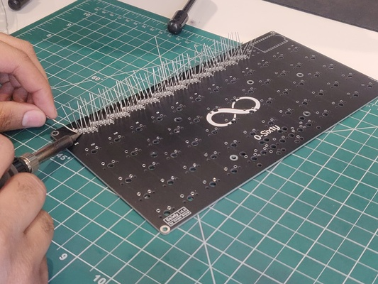
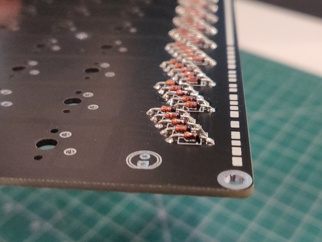
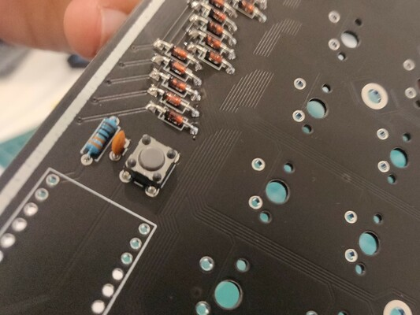
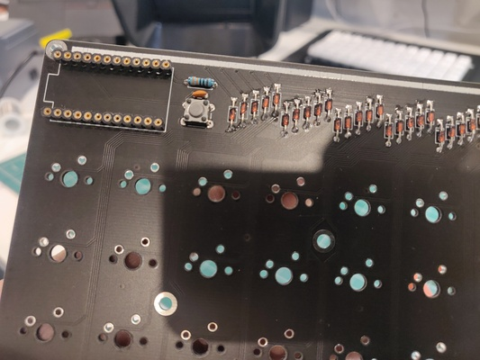
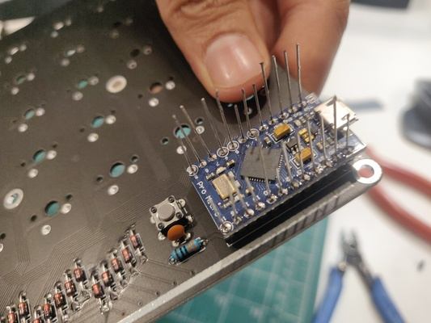
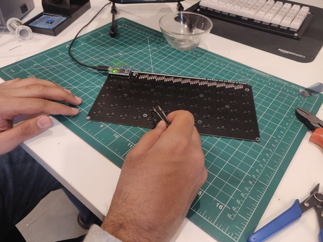
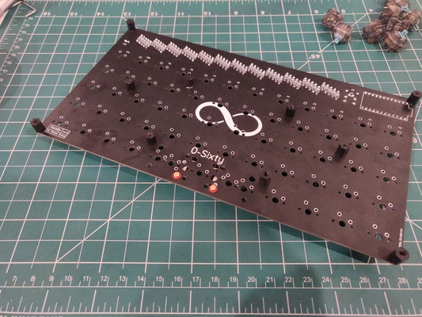
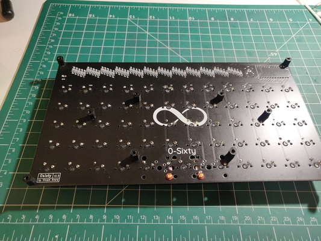
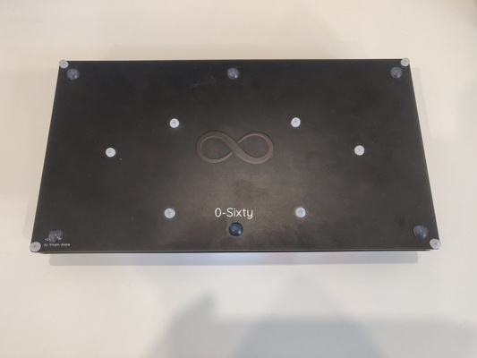

# 0-Sixty: Build Guide
----

## Required Items

### PCB Set
1. Top PCB
2. Bottom PCB (Baseplate)

### Component set
1. ProMicro (pre-flashed with VIA supported firmware)
2. Headers for ProMicro
3. 60 1N4148 Diodes
4. 330ohm Resistor
5. 22pF Capacitor
6. Reset Button
7. Inidicator LED
8. 20 M3 Screws and 10 Standoffs

### Other
1. Switches
2. Stabilizers (depending on what bottom-row layout you choose)
3. Keycaps
4. Micro-USB cable

### Tools
1. Flush cutter
2. Soldering iron/station and Solder
3. Tweezers
4. Isopropyl Alcohol (optional, for cleaning solder-flux residue)

**NOTE: If you got your PCB partly built from me, you can move on to step 2**

## 1. Soldering Circuit Components

This is how the components strip will look like upon completing this step.

1. **Diodes**
    - Remove diodes from the magazine.

	    
		
		

	- Bend diodes according to the spacing in the PCB. For max aesthetic points, stay accurate and consistent.

		
		

	- Place diodes into their holes in the PCB. Polarity matters here. Diode's polarity is indicated by the black line on its one side. To ensure you're placing it the correct way, use of this image and  silkscreen on the PCB as reference.

		

	- Solder!

		

	- Clip the legs of the diodes using a flush-cutter. It's important that you save these chopped-off diode legs in a bowl, as we'll be using them later.

		
		
		


2. **Resistor, capacitor, reset button**

   
   

   - For resistor and capacitor, direction doesn't matter.
   - The reset button naturally fits in the PCB with the correct alignment (you can use the image to make sure).
   - Solder these, and clip off resistor's legs with a flush cutter.


3. **ProMicro**
There are 2 ways to go about soldering the ProMicro. I would encourage you to go with the 1st method. Here they are:

   - **Method 1**: Slightly difficult to solder. Easy to replace ProMicro (which you might need to if your promicro breaks for any reason)
      - Use these pin-headers

	     

      - Carefully cut them into 2 headers with 12 pins each.

         

      - Solder the headers into the PCB.

	     

      - Place the ProMicro above the headers, and put the diode legs you had saved earlier in the 4 corner pins. Using tweezers makes this slightly easier. Solder these 4 pins from the top of the promicro.

	     

	  - Put the remaining pins, and solder them all. Clip these after testing the board (later step).

	     

	     Now, if this ProMicro breaks for any reason you can just pull it out (with some force), put a new one in and solder it the same way. No need for all the de-soldering mess.


   - **Method 2**: Easy to solder. Hard to desolder if ProMicro needs to be replaced for any reason (it can break).
      - Use these headers (also included in the components bag)

	     

	  - Solder them to the ProMicro first

	     

	  - Solder this to the PCB.

4. **Indicator LED (optional)**
   - Polarity matters here. To help us, the 2 legs of the LED have different length. The longer leg goes through the round solder pad, while the shorter one goes through the square solder pad. Refer to the image below.

       


	Congratulations, the circuit is complete! Let's test the board now!


## 2. Flashing Firmware and Testing the Board

   - **Flashing firmware**
	 - If you got your ProMicro from me, then it would already be flashed with the VIA supported firmware, and you can skip this section.

	 - If you're on Windows/Mac:
		 - Get the firmware's hex file from here: [0\_sixty\_via.hex](0_sixty_via.hex). Or you can build your own [here](https://config.qmk.fm/#/0_sixty/).
		 - Get QMK Toolbox and learn how to use it from [this video](https://www.youtube.com/watch?v=fuBJbdCFF0Q)
		 - Flash! (the MCU is atmega32u4 for this board; to reset the board press the reset button **twice**)

	 - If you're on Linux:
		 - Setup QMK by following the instructions [here](https://docs.qmk.fm/#/newbs_getting_started)

		 - Run

		    ```
			qmk flash -kb 0_sixty -km via
			```

		    Then press the reset button **twice** when qmk says `Detecting USB port`. The flashing pocess should start automatically.

   - **Testing**

	1. Connect your board back to the computer. Open up VIA ([download from here](https://github.com/the-via/releases/releases)). Wait for the board to show up as '*0-SIXTY BY VEN0MTR0N*'. Open up '*KEY TESTER*' and toggle '*Test Matrix*' on.

	   

	2. Use something conductive--a piece of wire or diode legs or metal tweezers to manually bridge the 2 silver contacts on every switch's footprint. When you do so, the corresponding box in VIA should change color from grey to pink. Do this for all switches.

	   

	If you were able to do this for all switches, you can be sure that the PCB works correctly, and move ahead.


## 3. Top-screws, Standoffs and Stabilizer(s)
Screw the standoffs to the PCB. This is kinda important to do **before** soldering switches, because these being M3 screws are a tad bit bigger than what the switches will allow to pass after they're soldered.




For stabilizers, you'll have to make a decision on what bottom layer layout you want. Here's an image showing all possible bottom row layouts


## 4. Solder Switches
This one should be pretty obvious. Just take care of the bottom-row layout that you want.




## 5. Screw in the baseplate


